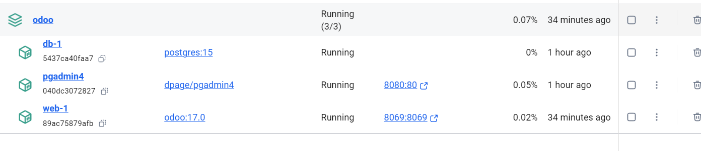
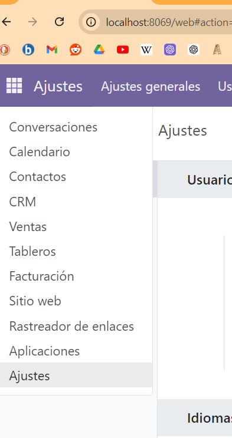
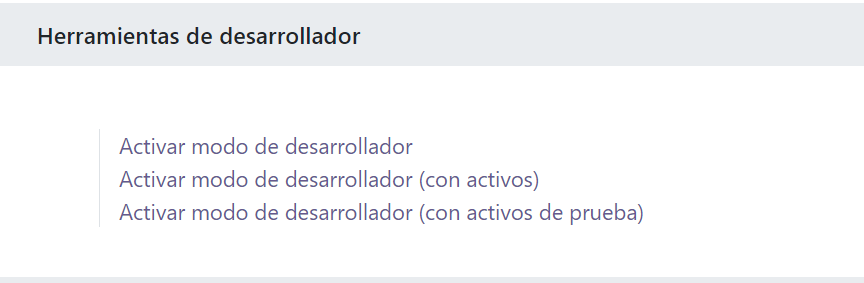
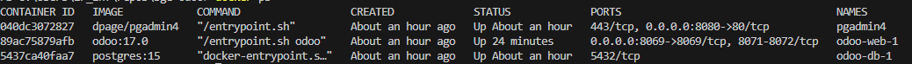
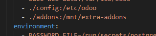
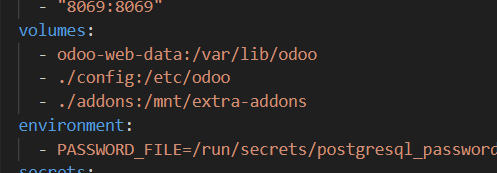
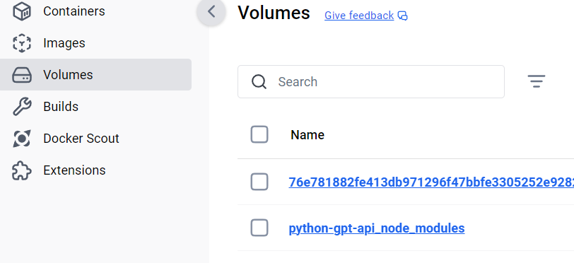

# Instalación y Creación de un modulo ODOO con Docker

- [Instalación y Creación de un modulo ODOO con Docker](#instalación-y-creación-de-un-modulo-odoo-con-docker)
  - [Instalar Docker :whale2:](#instalar-docker-whale2)
  - [Descargar este repositorio :sunglasses:](#descargar-este-repositorio-sunglasses)
    - [Crear un fichero para la contraseña :lock\_with\_ink\_pen:](#crear-un-fichero-para-la-contraseña-lock_with_ink_pen)
    - [Levantar el entorno :sunrise\_over\_mountains:](#levantar-el-entorno-sunrise_over_mountains)
  - [Cambiar al modo desarrolladores](#cambiar-al-modo-desarrolladores)
  - [Acceder al contendor Odoo :black\_medium\_square:](#acceder-al-contendor-odoo-black_medium_square)
  - [Crear un nuevo modulo](#crear-un-nuevo-modulo)
  - [Volumenes en docker](#volumenes-en-docker)
  - [Referencias :earth\_asia:](#referencias-earth_asia)


## Instalar Docker :whale2:
En windows, usar el instalador de Docker Desktop,:
- Hay que tener Hyper-V desactivado si puede ser  (En características de windows)
- Docke instalara el WSL que haga falta para su uso
- Es posible que haya que agregar al usuario del equipo al grupo, docker-users, en usuarios y grupos de windows

## Descargar este repositorio :sunglasses:

https://github.com/FPTxurdinagaDAM/sge-odoo

### Crear un fichero para la contraseña :lock_with_ink_pen:

Tal y como se puede ver en fichero `docker-compose.yml`  se extrae la contraseña de un fichero de texto plano llamado `postresql_password`. Crea el fichero con dicho nombre e introduce una única palabra con la contraseña deseada.

:warning: *Por motivos de simplicidad se utiliza la misma contraseña tanto para la base de datos como para la aplicación web. Se recomienda hacer una distinción aquí en producción.*

### Levantar el entorno :sunrise_over_mountains:

Abre una terminal en el directorio en el que está el fichero `docker-compose.yml` y ejecuta el comando.

```bash
docker compose up -d
```



Ya podemos acceder a las aplicaciones levantadas siguiendo los enlaces con los números de puerto en la interfaz de docker desktop. Podemos entrar y configurar muchos aspectos de la aplicación desde aquí.

## Cambiar al modo desarrolladores
En odoo, en ajustes, abajo del todo está la opción. Esto activa las herramientas de desarrolladores, que están en un boton con forma de bicho.





## Acceder al contendor Odoo :black_medium_square:

Lo primero que haremos es ver los nombres de los contenedores.

```bash
docker ps
```


La máquina que contiene la web tiene el nombre `odoo-web-1`. En docker, podemos ejecutar un comando en una maquina usando la instrucción `docker exec`. En este caso usaremos:

```bash
docker exec -it odoo-web-1 bash
```

Que ejecuta el programa bash de dentro del contenedor en modo interactivo. Como sabras, bash es una teminal.


## Crear un nuevo modulo

Para crear un nuevo modulo, usaremos el comando `odoo` de la siguiente manera.

1. En primer lugar, navegaremos a `/mnt/extra-addons`. Si os fijais en el fichero `docker-compose.yml`, este directorio esta asociado/relacionado (Binded)  a la carpeta `addons` en nuestro proyecto. *Si la carpeta no existe, se creará*



2. En segundo lugar, ejecutaremos el comando siguiente:

```bash
odoo scaffold modulo-custom
```

3. Ahora, puedes trabajar en el modulo creando las vistas, los modelos y la logica que te interese, usando tu sistema windows y desde este proyecto de VSCode. En este artículo de medium o mirando las referencias puedes econtrar cómo se hace.

[:part_alternation_mark: Arítculo de Medium sobre crear un modulo](https://medium.com/@waooseo/how-to-create-or-develop-a-custom-module-in-odoo-814b083473aa)

:warning: *Elimina la carpeta addons del fichero .gitignore para que el modulo que desarrolles se suba github*

## Volumenes en docker

Docker, es un entorno de virtualización de contenedores. Uno de los principios de diseño, es el de separación de responsabilidades. Se intenta separar el contendor de los datos, de forma que la máquina pueda desecharse o crearse mientras que se conserva la información. Esto se solucciona en parte gracias a los volumenes.

Los volumenes son directorios, que pueden estar bien enlazados a un directorio de nuestro equipo o bien tratarse de volumenes que se guardan en el entorno virtual de docker y se montan en una ruta del sistema de archivos del contendor. 



En la imagen vemos los dos tipos de volumenes:

- **odoo-web-data**: es un volumen virtual (no especifica ruta relativa o absoluta en el equipo host). Podemos, ver estos volumenes en la intefaz de Docker o con el comando `docker volume ls` 

---
 

- **./addons**: Es un volumen bindeado a una carpeta de nuestro equipo (incluye ruta relativa o absoluta)


## Referencias :earth_asia:

[:whale2: Docker Hub Odooo](https://hub.docker.com/_/odoo)
[:jigsaw: Building a Module](https://www.odoo.com/documentation/18.0/developer/tutorials/backend.html)
[:closed_book: Odoo Docs](https://www.odoo.com/documentation/18.0/applications.html)
[:part_alternation_mark: Arítculo de Medium sobre crear un modulo](https://medium.com/@waooseo/how-to-create-or-develop-a-custom-module-in-odoo-814b083473aa)